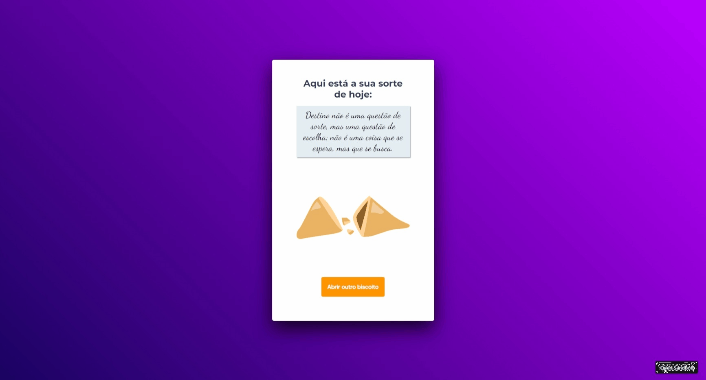

# Biscoito da Sorte

A ideia agora é criar o Jogo chamado Biscoito da Sorte,no qual o usuário, **a partir de um clique ou enter**, abre um biscoito com a sua sorte do dia. Você aplicará o que aprendeu sobre vários temas, entre eles:

- Estrutura de dados HTML
- Animações com CSS
- Funções no Javascript
- Manipulação da DOM
- Biblioteca JS Math()
- Funções _callback_
- Arrays

## Layout da aplicação

Aqui neste **[link](https://www.figma.com/community/file/1182751789348533739){:target="_blank"}** você tem acesso ao Figma do projeto**.** Abaixo você pode ver como a aplicação deve ficar:
<a href="https://www.figma.com/community/file/1182751789348533739" target="_blank">[</a>

## Deploy

Para Acessa o projeto acesse

## Demonstração

  
